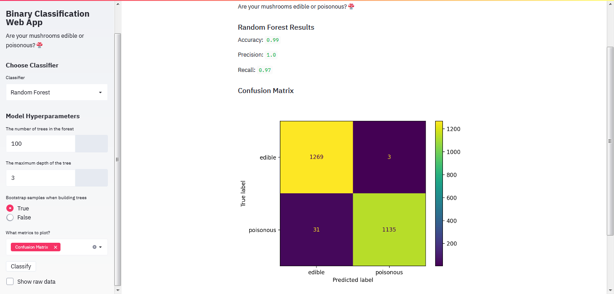

# Mushroom-Classification-using-Streamlit
Try this app out on : https://voyage-gerard-94371.herokuapp.com/
 The webapp is designed to classify whether the mushroom is edible or poisonous.
 
Streamlit’s open-source app framework is the easiest way for data scientists and machine learning engineers to create beautiful, performant apps in only a few hours!  All in pure Python. All for free.

Streamlit allows rapid webapp development without the knowledge of HTML and CSS. And no need to write backend or handle HTTP requests.
This code and idea is taken from Coursera's guided project - Build a Machine Learning Web App with Streamlit and Python
You can find the dataset here : https://archive.ics.uci.edu/ml/datasets/Mushroom

 
